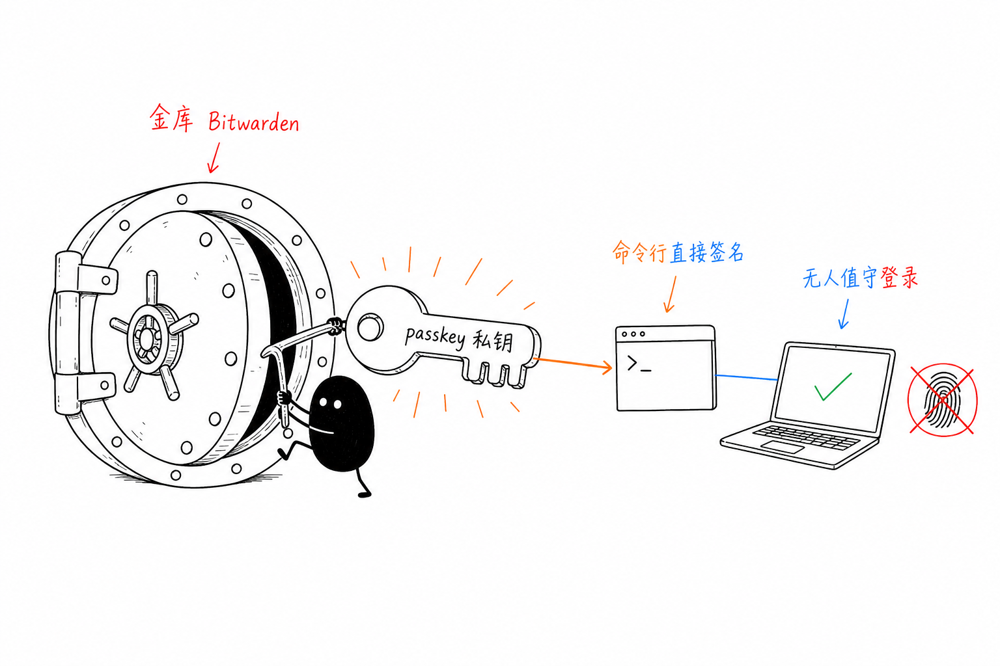

# bitwarden-use

<p align="center">
  
</p>

`bitwarden-use` is a command line client for
[Bitwarden](https://bitwarden.com/) and self-hosted
[Vaultwarden](https://github.com/dani-garcia/vaultwarden) servers, with
first-class support for extracting **FIDO2 / passkey** credentials from your
vault — so you can sign WebAuthn logins **headlessly**, with no browser and no
fingerprint tap.

Unlike the official stateless CLI — which requires you to manually lock and
unlock and pass temporary keys around in environment variables —
`bitwarden-use` keeps a background agent (`bitwarden-use-agent`) that holds the
keys in memory, similar to the way `ssh-agent` or `gpg-agent` work. The client
talks to that agent, so commands can be used directly and handle logging in or
unlocking as needed.

## Installation

**Prebuilt binary (recommended)** — no Rust toolchain, no npm, no token:

```sh
curl -fsSL https://raw.githubusercontent.com/leeguooooo/bitwarden-use/main/install.sh | sh
```

This pulls `bitwarden-use` + `bitwarden-use-agent` from the latest
[GitHub Release](https://github.com/leeguooooo/bitwarden-use/releases) (macOS
arm64/x64, Linux arm64/x64), verifies the checksum, and installs into
`~/.local/bin`. Override with `BITWARDEN_INSTALL_DIR=/usr/local/bin`, or pin a
version with `BITWARDEN_VERSION=v0.1.0`.

**From source** — any platform with a Rust toolchain:

```sh
cargo install --locked --path .
```

Both paths produce the two binaries `bitwarden-use` and `bitwarden-use-agent` and
require the
[`pinentry`](https://www.gnupg.org/related_software/pinentry/index.en.html)
program (to display password prompts). The installer also drops a short **`bwu`**
symlink so you can type `bwu fido2 list` instead of the full name.

## Configuration

Configuration options are set using the `bitwarden-use config` command.
Available configuration options:

* `email`: The email address to use as the account name when logging into the
  server. Required.
* `sso_id`: The SSO organization ID. Defaults to regular login process if unset.
* `base_url`: The URL of the Bitwarden/Vaultwarden server to use. Defaults to
  the official server at `https://api.bitwarden.com/` if unset.
* `identity_url`: The URL of the identity server to use. If unset, will use the
  `/identity` path on the configured `base_url`, or
  `https://identity.bitwarden.com/` if no `base_url` is set.
* `ui_url`: The URL of the web UI to use. If unset, defaults to
  `https://vault.bitwarden.com/`.
* `notifications_url`: The URL of the notifications server to use. If unset,
  will use the `/notifications` path on the configured `base_url`, or
  `https://notifications.bitwarden.com/` if no `base_url` is set.
* `lock_timeout`: The number of seconds to keep the master keys in memory for
  before requiring the password to be entered again. Defaults to `3600` (one
  hour).
* `sync_interval`: The agent will automatically sync the database from the
  server at this interval (in seconds) while running. Set to `0` to disable.
  Defaults to `3600` (one hour).
* `pinentry`: The
  [pinentry](https://www.gnupg.org/related_software/pinentry/index.html)
  executable to use. Defaults to `pinentry`.

### Profiles

`bitwarden-use` supports different configuration profiles, switched via the
`RBW_PROFILE` environment variable. Setting it to a name (for example,
`RBW_PROFILE=work` or `RBW_PROFILE=personal`) lets you switch between several
vaults — each uses its own separate configuration, local vault, and agent.

## Usage

Commands can generally be used directly, and will handle logging in or
unlocking as necessary. For instance, `bitwarden-use ls` will unlock the
password database before listing entries (but will not log in to the server),
`bitwarden-use sync` will log in before downloading the database (but will not
unlock it), and `bitwarden-use add` will do both.

Logging in and unlocking are only done as necessary, so running
`bitwarden-use login` when already logged in does nothing, and similarly for
`bitwarden-use unlock`. You can explicitly log out with `bitwarden-use purge`,
and explicitly lock the database with `bitwarden-use lock` or
`bitwarden-use stop-agent`.

`bitwarden-use help` gives more information about the available functionality.

Run `bitwarden-use get <name>` to get your passwords. Use `--full` to also show
the username and note, `--field=<field>` to get a specific default or custom
field, and `--raw` to print JSON. In addition to matching against the name,
you can pass a UUID to search for the entry with that id, or a URL to search
for an entry with a matching website entry.

*Note for users of the official Bitwarden server (at bitwarden.com)*: the
official server has a tendency to detect command line traffic as bot traffic.
To use `bitwarden-use` with it, first run `bitwarden-use register` to register
each device with the server. This prompts for your personal API key, which you
can find using the instructions
[here](https://bitwarden.com/help/article/personal-api-key/).

### FIDO2 / passkeys

`bitwarden-use fido2` works with FIDO2 (passkey) credentials stored in your
vault:

* `bitwarden-use fido2 list` — list passkeys (entry name, rpId, credentialId).
* `bitwarden-use fido2 get <name>` — display a passkey, including its decrypted
  private key as base64url and as a PKCS#8 PEM document. The entry can be
  selected by name, URI, UUID, or by the credentialId of the passkey itself.

### SSH Agent

`bitwarden-use-agent` includes a built-in SSH agent for signing SSH
authentication challenges directly. Ensure the agent is running (unlock once),
then point your SSH client at its socket:

```sh
bitwarden-use unlock
export SSH_AUTH_SOCK="$XDG_RUNTIME_DIR/rbw/ssh-agent-socket"
```

If you're using a profile, the socket is located at
`"$XDG_RUNTIME_DIR/rbw-<profile>/ssh-agent-socket"`.

> The on-disk config, cache, and runtime directories are named `rbw` for
> compatibility, so an existing rbw/Vaultwarden login keeps working under
> `bitwarden-use` with no migration.

### 2FA support

`bitwarden-use` supports the following 2FA mechanisms:

* Email
* Authenticator App
* Yubico OTP security key

WebAuthn / Passkey and Duo are unsupported as 2FA mechanisms. If you only use
an unsupported mechanism, add a supported one to your account so the CLI can
authenticate; you can keep using your preferred mechanism with other clients.
